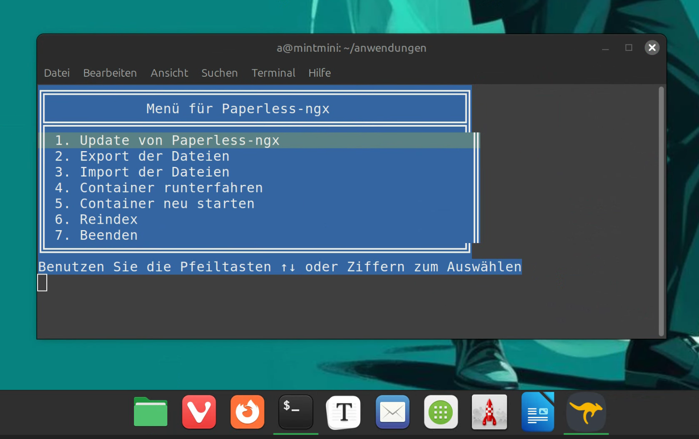

# paperless-commander
Bash script for Paperless-ngx.

## What can the script do?

It provides important commands for maintaining Paperless-ngx in menu form. It is based on a docker-compose installation in the path “paperless-ngx”. The script is commented so that you can easily make your own adjustments.

## Installation and call

1. download “pplc.sh” to the corresponding path (e.g. as “/home/pi/paperless-ngx”).
2. assign authorization: chmod +x pplc.sh.
3. start with ./pplc.sh

## Was kann das Skript?

Es stellt wichtige Befehle für die Pflege von [Paperless-ngx](https://docs.paperless-ngx.com) in Menüform bereit. Dabei orientiert es sich an einer docker-compose-Installation im Pfad "paperless-ngx". Das Skript ist kommentiert, so dass leicht eigene Anpassungen vorgenommen werden können.

## Installation und Aufruf

1. Download von "pplc.sh" in den entsprechenden Pfad (als z. B. "/home/pi/paperless-ngx").
2. Berechtigung vergeben: chmod +x pplc.sh.
3. Start mit ./pplc.sh

