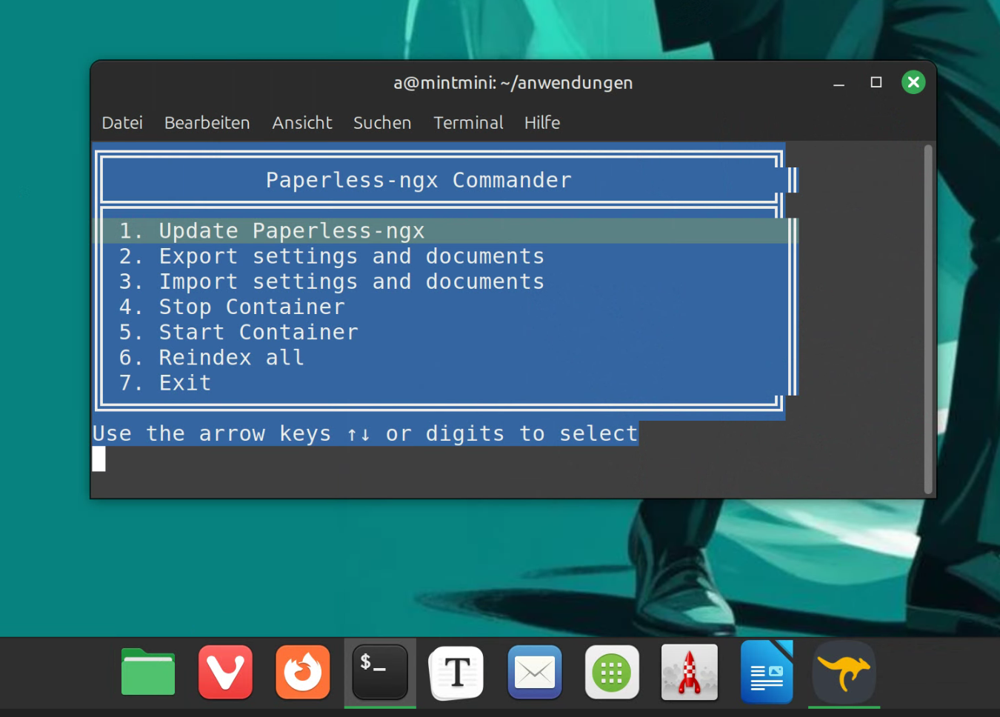

# paperless-commander
Bash script for Paperless-ngx.

## Attention!
The script is currently in beta stage! It is not yet intended for productive use. 

## What can the script do?

It provides important commands for maintaining Paperless-ngx in menu form. It is based on a docker-compose installation in the path “paperless-ngx”. The script is commented so that you can easily make your own adjustments.

## Installation and call

1. download “pplc.sh” to the corresponding path (e.g. as “/home/pi/paperless-ngx”).
2. assign authorization: chmod +x pplc.sh.
3. start with ./pplc.sh

